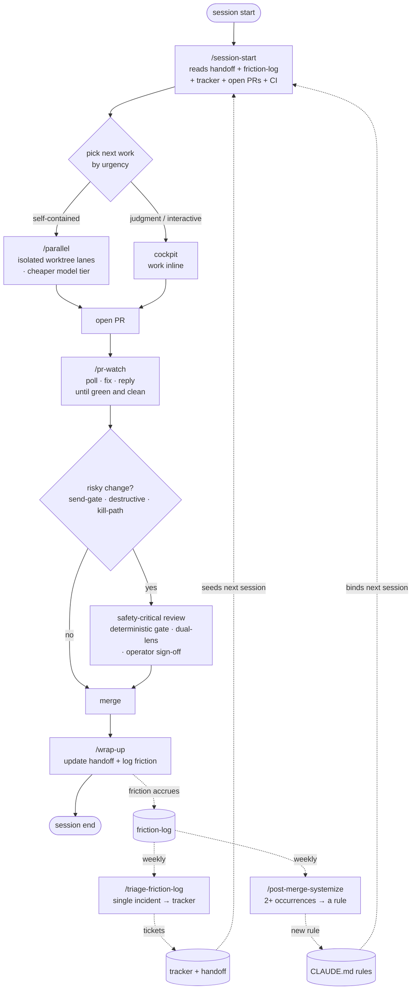

# agentic-dev-kit

A portable development model for codebases built with the help of AI coding
agents — interactive and unattended alike. It packages ten doctrine principles
(see [`PRINCIPLES.md`](PRINCIPLES.md)) into the small set of files that actually
make them stick: two narrative documents, a handful of skills, a few engine
scripts, a state sandbox, and one safety-critical rule.

**Copy-in, repo-owned.** You copy this template into your repo and run
`./init.sh` once. From then on the kit is yours — no external package, no
upstream dependency at runtime. Edit the config, rename things, delete a skill
you don't need. A future packaged version (a plugin plus an installable engine)
waits until the template has proven itself across a few real projects.

## Why this exists

When you build software with AI coding agents — especially several at once, some
running unattended, with a single human operator who isn't watching every step —
the hard part stops being *generating* code. It becomes keeping the work
**coherent**. The recurring failure modes:

- **Context evaporates between sessions.** A fresh session (yours or an agent's)
  reconstructs "where were we?" from memory or scrollback, and silently redoes or
  regresses the last one's work.
- **Parallel agents step on each other** — two lanes writing the same scratch
  state or the same plan file corrupt each other's output or collide at merge.
- **Rough edges get forgotten** — the annoyance you hit an hour ago is gone by the
  next session, so nobody fixes it. Or the opposite: every one-off incident gets
  promoted into a standing rule until the rules are noise nobody reads.
- **Risky changes get rubber-stamped** — a send-gate or a destructive operation
  slips through bundled with cosmetic diffs, or a PR is opened and abandoned
  mid-CI with no one watching it to green.
- **The wrong effort goes to the wrong step** — top-tier reasoning burned on a
  mechanical rename, or a cheap pass on the one decision that was expensive to get
  wrong.
- **Rules a fresh agent "should have known" don't bind it** — because they live in
  a doc nobody re-reads instead of in the launch prompt, a hook, or a CI check.

`agentic-dev-kit` is a small, opinionated answer to those failure modes: ten
doctrine principles plus the minimum set of files — narrative docs, skills, hooks,
scripts — that make each one *stick* rather than stay a good intention. It assumes
a single operator, agents working on branches behind pull requests, and review
before merge. Adopt the pieces incrementally; each stands on its own.

## How it fits together

One session runs the inner loop — **session-start → work → pr-watch → wrap-up** —
while the **friction flywheel** turns underneath it, feeding tickets and new rules
back into the next session's briefing.



Solid arrows are one session's flow; dotted arrows are the asynchronous flywheel
(**down** by default — incidents to the tracker — and **up** only on repetition —
patterns to rules).

## Quickstart

```sh
# Click "Use this template" on GitHub and clone the result — or, into an
# existing repo, copy the kit's contents in from the root:
cp -r /path/to/agentic-dev-kit/. .
./init.sh
# Answer the prompts (or accept the shown defaults), then:
#   -> open config/dev-model.yaml and fill in anything you skipped
#   -> start your agent session and run /session-start
```

Ten minutes, start to finish. For a full worked example of a first session — from
adoption through `/wrap-up` — see **[`docs/getting-started.md`](docs/getting-started.md)**.

## What's inside

Each piece maps to one or more of the ten principles in
[`PRINCIPLES.md`](PRINCIPLES.md).

| Piece | Principle(s) | Purpose |
|---|---|---|
| `docs/handoff.md` + `docs/handoff-history.md` | #1 Living-plan handoff | The one canonical plan — read at session start, updated at session end. Older sessions sweep to the history file once it crosses a line budget. |
| `docs/friction-log.md` + `docs/friction-log-archive.md` | #2 Friction flywheel | Append-only inbox for bugs and rough edges, triaged on a cadence: single incidents route down to your tracker, real patterns graduate up into a rule. |
| `scripts/lib/state_paths/` | #3 Cockpit + isolated lanes | The sandboxed state-path resolver so parallel agent lanes never clobber each other's scratch state. |
| `.claude/commands/*.md` (six skills) | #1, #2, #3, #5 | `session-start`, `wrap-up`, `parallel`, `pr-watch`, `triage-friction-log`, `post-merge-systemize` — the operational surface that reads and writes the narrative files and runs the review loop. |
| `docs/CLAUDE-sections.md` | #4 Merge classes, #5 PR follow-through | Ready-to-paste CLAUDE.md sections: risk-based PR splitting, the mandatory watch-to-green loop, execution rules, the rules-layout convention. |
| `docs/autonomous-session-playbook.md` | #4, #5, #7 | The full operating contract for operator-requested autonomous sessions — branch hygiene, sequencing, local gate, draft→ready, watch-and-fix to merge, self-merge policy. |
| `.claude/rules/safety-critical-changes.md` | #6 Safety-critical doctrine | The review doctrine for send-gates, destructive operations, and kill/recovery paths — deterministic gate over matcher, multi-lens review, human sign-off only. |
| `config/dev-model.yaml` | #10 No hardcoding | The single config surface every skill and script reads instead of hardcoding a value. |
| `scripts/check_doc_budget.py`, `scripts/archive_plan_sessions.py` | #1 | The tripwire and sweep that keep the handoff file from ballooning. |
| `scripts/pr_watch.py` | #5 | The poll-fix-ack engine behind `/pr-watch`. |
| `scripts/dev_session.sh`, `scripts/reconcile_sessions.sh` | #3 | Worktree/lane launcher and reconciler. |
| `scripts/hooks/pre-push` | #8 Mechanism over memory | A hook, not a memory — refuses a push that would corrupt the narrative files. |

Principles #7 (model/effort tiering) and #9 (deterministic scaffolding around
LLM steps) are doctrine woven into the skills and scripts above rather than a
standalone file — read `PRINCIPLES.md` for both.

**Four skills ship wired; two ship as doctrine.** `session-start`, `wrap-up`,
`parallel`, and `pr-watch` come with their engine scripts and run out of the
box. `triage-friction-log` and `post-merge-systemize` document the flywheel's
triage and pattern-finding mechanism, but their deterministic engines (a tracker
client, a notify channel, and a merged-PR fetcher) are project-specific and left
for you to wire — see the banner atop each of those two skill files.

## Parallel dev sessions

When you want several agent sessions running at once, the kit keeps them from
clobbering each other: one **cockpit** session owns the narrative files and the
merges, while each unit of work runs in an isolated **lane** — its own git worktree,
branch, and `DEVKIT_STATE_ROOT` state sandbox. The rule that makes it safe is
**disjoint file footprints**: two lanes may run together only when no source file is
edited by both (the sandbox prevents *state* collisions, not *source* merge conflicts).

The flow: `/parallel plan` clusters candidate work by footprint → launch a lane per
disjoint cluster (`scripts/dev_session.sh new`) → each lane works to a draft-green PR →
the cockpit reconciles every lane and merges. Each lane gets an effort tier and a merge
class (self-merge vs operator-merge) assigned at plan time.

Full walkthrough — the lane contract, the live board, reconciliation, and a worked
example — in **[`docs/parallel-dev.md`](docs/parallel-dev.md)**.

## Adapting it

Once you've adopted the kit, it's yours. `config/dev-model.yaml` is the single
place to point the skills and scripts at your project's paths, tracker, review
bots, and model tiers — start there. Beyond config, edit the skills and scripts
freely: they're prompts and small stdlib scripts, meant to be read and changed.
The one module with a real test suite is `scripts/lib/state_paths/` — run its
tests (`python -m pytest scripts/lib/state_paths/tests/`) if you modify it.

Improvements that would help other adopters are welcome back here.

## License

MIT — see [`LICENSE`](LICENSE).
