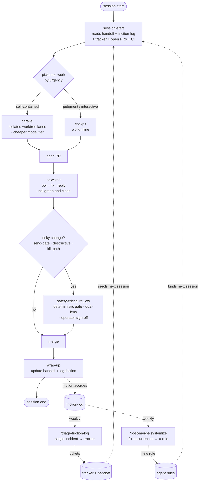

# agentic-dev-kit

A portable development model for codebases built with the help of AI coding
agents — interactive and unattended alike. It packages ten doctrine principles
(see [`PRINCIPLES.md`](PRINCIPLES.md)) into the small set of files that actually
make them stick: two narrative documents, a handful of skills, a few engine
scripts, a state sandbox, and one safety-critical rule.

**Copy-in, repo-owned.** You copy this template into your repo and run
`./init.sh` once. From then on the kit is yours — no external package, no
upstream dependency at runtime. Edit the config, rename things, delete a skill
you don't need. A future packaged version (a plugin plus an installable engine)
waits until the template has proven itself across a few real projects.

> **A personal note.** I built this for my own development work with AI coding agents.
> The principles and choices here reflect my own preferences and workflows — not a
> universal best practice. Take what's useful, change what isn't, and shape it to fit
> how you like to work.

## Why this exists

When you build software with AI coding agents — especially several at once, some
running unattended, with a single human operator who isn't watching every step —
the hard part stops being *generating* code. It becomes keeping the work
**coherent**. The recurring failure modes:

- **Context evaporates between sessions.** A fresh session (yours or an agent's)
  reconstructs "where were we?" from memory or scrollback, and silently redoes or
  regresses the last one's work.
- **Parallel agents step on each other** — two lanes writing the same scratch
  state or the same plan file corrupt each other's output or collide at merge.
- **Rough edges get forgotten** — the annoyance you hit an hour ago is gone by the
  next session, so nobody fixes it. Or the opposite: every one-off incident gets
  promoted into a standing rule until the rules are noise nobody reads.
- **Risky changes get rubber-stamped** — a send-gate or a destructive operation
  slips through bundled with cosmetic diffs, or a PR is opened and abandoned
  mid-CI with no one watching it to green.
- **The wrong effort goes to the wrong step** — top-tier reasoning burned on a
  mechanical rename, or a cheap pass on the one decision that was expensive to get
  wrong.
- **Rules a fresh agent "should have known" don't bind it** — because they live in
  a doc nobody re-reads instead of in the launch prompt, a hook, or a CI check.

`agentic-dev-kit` is a small, opinionated answer to those failure modes: ten
doctrine principles plus the minimum set of files — narrative docs, skills, hooks,
scripts — that make each one *stick* rather than stay a good intention. It assumes
a single operator, agents working on branches behind pull requests, and review
before merge. Adopt the pieces incrementally; each stands on its own.

## How it fits together

One session runs the inner loop — **session-start → work → pr-watch → wrap-up** —
while the **friction flywheel** turns underneath it, feeding tickets and new rules
back into the next session's briefing.


```mermaid
flowchart TD
    A([session start]) --> B["session-start<br/>reads handoff + friction-log<br/>+ tracker + open PRs + CI"]
    B --> C{"pick next work<br/>by urgency"}
    C -->|self-contained| D["parallel<br/>isolated worktree lanes<br/>· cheaper model tier"]
    C -->|judgment / interactive| E["cockpit<br/>work inline"]
    D --> F["open PR"]
    E --> F
    F --> G["pr-watch<br/>poll · fix · reply<br/>until green and clean"]
    G --> H{"risky change?<br/>send-gate · destructive · kill-path"}
    H -->|yes| I["safety-critical review<br/>deterministic gate · dual-lens<br/>· operator sign-off"]
    H -->|no| J["merge"]
    I --> J
    J --> K["wrap-up<br/>update handoff + log friction"]
    K --> L([session end])

    K -. friction accrues .-> M[(friction-log)]
    M -. weekly .-> N["/triage-friction-log<br/>single incident → tracker"]
    M -. weekly .-> O["/post-merge-systemize<br/>2+ occurrences → a rule"]
    N -. tickets .-> P[(tracker + handoff)]
    O -. new rule .-> Q[(agent rules)]
    P -. seeds next session .-> B
    Q -. binds next session .-> B
```

Solid arrows are one session's flow; dotted arrows are the asynchronous flywheel
(**down** by default — incidents to the tracker — and **up** only on repetition —
patterns to rules).

## Quickstart

**Prerequisites.** `init.sh` itself needs only POSIX `sh`, `awk`, and `git`. The
engines need [`uv`](https://docs.astral.sh/uv/) (they're PEP-723 single-file
scripts), `git`, and — for `pr-watch` / `parallel` — the GitHub CLI `gh`,
authenticated. No PyYAML: the config reader is stdlib-only.

```sh
# Click "Use this template" on GitHub and clone the result — or, into an
# existing repo, copy the kit's contents in from the root:
cp -r /path/to/agentic-dev-kit/. .
./init.sh
# Answer the prompts (or accept the shown defaults), then:
#   -> open config/dev-model.yaml and fill in anything you skipped
#   -> start your agent session and invoke session-start
```

`init.sh` stamps your answers into `config/dev-model.yaml`, renders the narrative
docs from `docs/templates/`, installs the pre-push hook, and adds the state
sandbox to `.gitignore`. It never overwrites a narrative doc that is already in
use — only one still carrying the shipped `devkit-template: unrendered` marker.

Ten minutes, start to finish. For a full worked example of a first session — from
adoption through `wrap-up` — see **[`docs/getting-started.md`](docs/getting-started.md)**.

## Upgrading an already-adopted repo

**Pull the new kit files, then re-run `./init.sh`.** That is the supported upgrade
path, and it is safe to run any number of times:

- **Config** — `init.sh` migrates an older schema forward *in place*, only ever
  adding missing keys. Your existing values are never guessed over. `kit.version`
  records which generation you're on.
- **`paths.engines`** — probed from where your engines actually are, so a repo that
  vendored them under `scripts/devkit/` is migrated to that path rather than a
  wrong default.
- **Narrative docs** — a handoff or friction log you're actually using is left
  byte-identical; only an unrendered skeleton is (re-)rendered.
- **Hooks** — reinstalled as a shim that execs the engine, so a hook stays current
  with the engine rather than going stale as a copy.
- **Engines** — replace the files. Engines are **kit-owned**: everything
  project-specific (review-bot markers, informational checks, CI policy, paths)
  lives in `config/dev-model.yaml`, so you should never need to edit an engine to
  adopt it. If you have, that's a bug — please report it.

### Which files actually drifted — `kit_doctor`

Re-running `init.sh` handles the config. For the **engines**, the problem is that a
copy-in has no version marker and no record of whether it was edited, so nothing can
tell an older engine from a locally-patched one:

```sh
uv run scripts/kit_doctor.py     # or: python scripts/kit_doctor.py   # stdlib only, no uv needed
```

Per kit-owned file it reports `unchanged` (safe to replace outright), `differs` (diff
before replacing), `missing`, or `unknown-version`. `differs` deliberately does **not**
claim a cause — a hash mismatch can't distinguish "older version" from "hand-edited", so
it narrows by schema version and leaves the call to you. Adopter-owned paths (your
config, your narrative docs) are never compared; they're *supposed* to differ.

It also checks four things nothing else validates:

- your config's schema generation vs. the kit's
- that **`paths.engines` points at a directory that actually holds engines** — a `✗` here
  is the silent breakage where every workflow's `<engine-dir>/…` reference resolves to
  nothing
- that the pre-push hook is installed, not merely shipped
- that the narrative docs were rendered, not left as unrendered templates

`kit-manifest.json` is the hash set it compares against, regenerated at release
(`--generate-manifest`) and gated in CI so it can't go stale.

**[`/upgrade`](.claude/commands/upgrade.md)** drives the whole sequence — shape detection,
config migration, then per-file refresh keyed on those states — non-destructively, on a
branch. It's the counterpart to [`/adopt`](.claude/commands/adopt.md) (first install). A
repo with no `config/dev-model.yaml` at all predates the config surface and routes to
`/adopt` instead.

### Agent runtime adapters

The workflow definitions under `docs/agentic-dev-kit/workflows/` are shared. The
runtime adapters are intentionally thin:

| Runtime | Repository adapter | Invocation |
|---|---|---|
| Claude Code | `.claude/commands/<name>.md` | `/session-start`, `/wrap-up`, `/pr-watch`, `/parallel` |
| Codex | `.agents/skills/<name>/SKILL.md` | `$session-start`, `$wrap-up`, `$pr-watch`, `$parallel` |

Set `runtime.default` in `config/dev-model.yaml`. The lane launcher reads its command
from `runtime.launchers`; shared workflows use the runtime-neutral
`cheap`/`default`/`expensive` tiers and translate them through
`models.runtime_mappings` only when the runtime exposes that control.

## Adopting into an existing repo

The quickstart above assumes a fresh or near-empty repo. Dropping the kit into a
**mature** project — one that already has agent configuration, its own `config/`, a
plan doc, and CI — needs a lighter touch: a blind `cp -r` would clobber files. Adopt
selectively instead.

**The [`/adopt`](.claude/commands/adopt.md) skill automates this.** Copy
`.claude/commands/adopt.md` into your repo, run `/adopt`, and it inspects the repo,
proposes a selective plan (what to install vs. skip vs. point the config at), and
executes it non-destructively on a branch — then seeds the friction log with whatever
the adoption surfaced. The principles it applies:

- **Install only what you lack.** If the repo already practices a piece — a living
  plan, its own wrap-up skill — keep its version and skip the kit's. Each principle
  stands alone.
- **Point the config at what's already there.** Already have a `ROADMAP.md` or similar
  plan? Set `paths.handoff` to it in `config/dev-model.yaml` rather than adding a
  second plan file — or rename it to `handoff.md` if you prefer the kit's name.
- **Don't overwrite existing skills.** Check both `.claude/commands/<skill>.md` and
  `.agents/skills/<skill>/SKILL.md`. Keep an adopter's existing workflow and install
  only the missing adapters.
- **Namespace the scripts if `scripts/` is organized.** If the repo keeps `scripts/`
  in subdirs, vendor the kit under `scripts/devkit/` (or similar) and set
  `paths.engines` accordingly. Every engine discovers the repo root by walking up for
  `.git`, so it works at any depth without prompt rewrites.
- **Check your CI/lint scope.** The `state_paths` tests use bare `assert` (they're
  pytest tests) — make sure a repo-wide lint scopes away from the kit's dir or ignores
  `S101` there.

> This path was walked for real: a pilot into a live, mature repo, whose adoption
> friction became several of the fixes in this version.

## What's inside

Each piece maps to one or more of the ten principles in
[`PRINCIPLES.md`](PRINCIPLES.md).

| Piece | Principle(s) | Purpose |
|---|---|---|
| `docs/handoff.md` + `docs/handoff-history.md` | #1 Living-plan handoff | The one canonical plan — read at session start, updated at session end. Older sessions sweep to the history file once it crosses a line budget. |
| `docs/friction-log.md` + `docs/friction-log-archive.md` | #2 Friction flywheel | Append-only inbox for bugs and rough edges, triaged on a cadence: single incidents route down to your tracker, real patterns graduate up into a rule. |
| `docs/templates/` | #1, #2 | The `.tmpl` sources `init.sh` renders into the four narrative docs above on adopt or upgrade — never overwrites one already in use. |
| `scripts/lib/state_paths/` | #3 Cockpit + isolated lanes | The sandboxed state-path resolver so parallel agent lanes never clobber each other's scratch state. |
| `docs/agentic-dev-kit/workflows/` | #1, #2, #3, #5 | Runtime-neutral definitions for `session-start`, `wrap-up`, `parallel`, and `pr-watch`. |
| `docs/agentic-dev-kit/workflows/parallel-headless.md` | #3 Cockpit + isolated lanes | Unattended/headless lane launch mechanics split out of `parallel.md` — the `--headless` JSON descriptor, the lane-contract preamble, the fan-out recipe. |
| `.claude/commands/` + `.agents/skills/` | #1, #2, #3, #5 | Thin Claude and Codex adapters over the shared workflows. Claude also ships the project-specific `triage-friction-log`, `post-merge-systemize`, and `adopt` commands. |
| `docs/AGENTS-sections.md` | #4, #5, #6 | Ready-to-merge persistent instructions for Codex adopters. |
| `docs/CLAUDE-sections.md` | #4 Merge classes, #5 PR follow-through | Ready-to-paste CLAUDE.md sections: risk-based PR splitting, the mandatory watch-to-green loop, execution rules, the rules-layout convention. |
| `docs/autonomous-session-playbook.md` | #4, #5, #7 | The full operating contract for operator-requested autonomous sessions — branch hygiene, sequencing, local gate, draft→ready, watch-and-fix to merge, self-merge policy. |
| `docs/agentic-dev-kit/safety-critical-changes.md` | #6 Safety-critical doctrine | Shared doctrine for send-gates, destructive operations, and kill/recovery paths; bound through the Claude rule and the suggested `AGENTS.md` section. |
| `config/dev-model.yaml` | #10 No hardcoding | The single config surface every skill and script reads instead of hardcoding a value. |
| `scripts/lib/kitconfig.py` | #10 No hardcoding | Stdlib-only reader for `config/dev-model.yaml`, used where an engine must stay dependency-free (`pr_watch.py` declares zero third-party deps). |
| `scripts/check_doc_budget.py`, `scripts/archive_plan_sessions.py` | #1 | The tripwire and sweep that keep the handoff file from ballooning. |
| `scripts/pr_watch.py` | #5 | The poll-fix-ack engine behind `pr-watch`. |
| `scripts/dev_session.sh`, `scripts/reconcile_sessions.sh` | #3 | Worktree/lane launcher and reconciler. |
| `scripts/hooks/pre-push` | #8 Mechanism over memory | A hook, not a memory — refuses a push that would corrupt the narrative files. |

Principle #7 (model/effort tiering) is doctrine actually woven into the pieces
above, not just described by them: the tier table lives in `config/dev-model.yaml`
and travels with each lane through `parallel`. **Principle #9 (deterministic
scaffolding around LLM steps) is only partly real in the shipped kit.**
`scripts/pr_watch.py`'s seen-set is the one durable intermediate state the kit
actually ships. The rest of #9's artifacts — a heartbeat, an input cap, resumability,
map-reduce batching — are *specified* in `.claude/commands/post-merge-systemize.md`,
but that skill's engine (a tracker client, a merged-PR fetcher, `heartbeat_cli.py`)
is not shipped, so the doctrine there is aspirational until it's vendored.
[Issue #7](https://github.com/topij/agentic-dev-kit/issues/7) tracks vendoring those
engines. Read `PRINCIPLES.md` for both principles' full statement.

**Four workflows ship wired for Claude and Codex; two ship as Claude-side doctrine.**
`session-start`, `wrap-up`, `parallel`, and `pr-watch` come with their engine scripts
and both runtime adapters. `triage-friction-log` and `post-merge-systemize` document
the flywheel's
triage and pattern-finding mechanism, but their deterministic engines (a tracker
client, a notify channel, and a merged-PR fetcher) are project-specific and left
for you to wire — see the banner atop each of those two skill files.

## Parallel dev sessions

When you want several agent sessions running at once, the kit keeps them from
clobbering each other: one **cockpit** session owns the narrative files and the
merges, while each unit of work runs in an isolated **lane** — its own git worktree,
branch, and `DEVKIT_STATE_ROOT` state sandbox. The rule that makes it safe is
**disjoint file footprints**: two lanes may run together only when no source file is
edited by both (the sandbox prevents *state* collisions, not *source* merge conflicts).

The flow: `parallel plan` clusters candidate work by footprint → launch a lane per
disjoint cluster (`scripts/dev_session.sh new … --merge-class self|operator`) → each
lane works to a green, ready-for-review PR → the cockpit reconciles every lane and completes
the recorded merge path. **Lanes mark their own PRs ready but never merge**: a `self`-class
lane is closed out by the cockpit through `scripts/dev_session.sh merge` (no operator
sign-off needed), an `operator`-class one only by an explicit operator decision.

Full walkthrough — the lane contract, the live board, reconciliation, and a worked
example — in **[`docs/parallel-dev.md`](docs/parallel-dev.md)**. For step-by-step
recipes per use case (and what actually happens when you run each `parallel` verb),
see **[`docs/parallel-howto.md`](docs/parallel-howto.md)**.

## Adapting it

Once you've adopted the kit, it's yours. `config/dev-model.yaml` is the single
place to point the skills and scripts at your project's paths, tracker, review
bots, and model tiers — start there. Beyond config, edit the skills and scripts
freely: they're prompts and small stdlib scripts, meant to be read and changed.
Run the state-sandbox and portability suites after modifying the engines:
`python -m pytest scripts/lib/state_paths/tests/ scripts/tests/`.

Improvements that would help other adopters are welcome back here.

## License

MIT — see [`LICENSE`](LICENSE).
