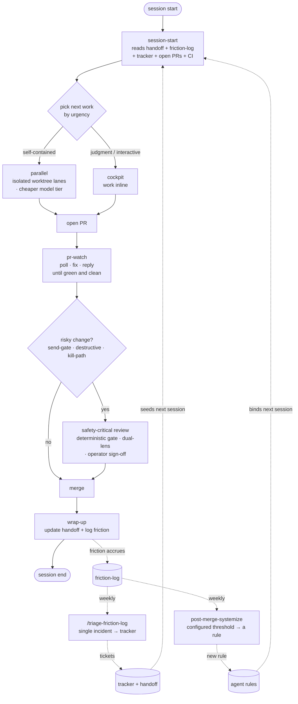

# agentic-dev-kit

A portable development model for codebases built with the help of AI coding
agents — interactive and unattended alike. It packages ten doctrine principles
(see [`PRINCIPLES.md`](PRINCIPLES.md)) into the small set of files that actually
make them stick: two narrative documents, a handful of skills, a few engine
scripts, a state sandbox, and one safety-critical rule.

**Copy-in, repo-owned.** You copy this template into your repo and run
`./init.sh` once. From then on the kit is yours — no external package, no
upstream dependency at runtime. Edit the config, rename things, delete a skill
you don't need. A future packaged version (a plugin plus an installable engine)
waits until the template has proven itself across a few real projects.

> **A personal note.** I built this for my own development work with AI coding agents.
> The principles and choices here reflect my own preferences and workflows — not a
> universal best practice. Take what's useful, change what isn't, and shape it to fit
> how you like to work.

## Why this exists

When you build software with AI coding agents — especially several at once, some
running unattended, with a single human operator who isn't watching every step —
the hard part stops being *generating* code. It becomes keeping the work
**coherent**. The recurring failure modes:

- **Context evaporates between sessions.** A fresh session (yours or an agent's)
  reconstructs "where were we?" from memory or scrollback, and silently redoes or
  regresses the last one's work.
- **Parallel agents step on each other** — two lanes writing the same scratch
  state or the same plan file corrupt each other's output or collide at merge.
- **Rough edges get forgotten** — the annoyance you hit an hour ago is gone by the
  next session, so nobody fixes it. Or the opposite: every one-off incident gets
  promoted into a standing rule until the rules are noise nobody reads.
- **Risky changes get rubber-stamped** — a send-gate or a destructive operation
  slips through bundled with cosmetic diffs, or a PR is opened and abandoned
  mid-CI with no one watching it to green.
- **The wrong effort goes to the wrong step** — top-tier reasoning burned on a
  mechanical rename, or a cheap pass on the one decision that was expensive to get
  wrong.
- **Rules a fresh agent "should have known" don't bind it** — because they live in
  a doc nobody re-reads instead of in the launch prompt, a hook, or a CI check.

`agentic-dev-kit` is a small, opinionated answer to those failure modes: ten
doctrine principles plus the minimum set of files — narrative docs, skills, hooks,
scripts — that make each one *stick* rather than stay a good intention. It assumes
a single operator, agents working on branches behind pull requests, and review
before merge. Adopt the pieces incrementally; each stands on its own.

## How it fits together

One session runs the inner loop — **session-start → work → pr-watch → wrap-up** —
while the **friction flywheel** turns underneath it, feeding tickets and new rules
back into the next session's briefing.


```mermaid
flowchart TD
    A([session start]) --> B["session-start<br/>reads handoff + friction-log<br/>+ tracker + open PRs + CI"]
    B --> C{"pick next work<br/>by urgency"}
    C -->|self-contained| D["parallel<br/>isolated worktree lanes<br/>· cheaper model tier"]
    C -->|judgment / interactive| E["cockpit<br/>work inline"]
    D --> F["open PR"]
    E --> F
    F --> G["pr-watch<br/>poll · fix · reply<br/>until green and clean"]
    G --> H{"risky change?<br/>send-gate · destructive · kill-path"}
    H -->|yes| I["safety-critical review<br/>deterministic gate · dual-lens<br/>· operator sign-off"]
    H -->|no| J["merge"]
    I --> J
    J --> K["wrap-up<br/>update handoff + log friction"]
    K --> L([session end])

    K -. friction accrues .-> M[(friction-log)]
    M -. weekly .-> N["/triage-friction-log<br/>single incident → tracker"]
    M -. weekly .-> O["post-merge-systemize<br/>configured threshold → a rule"]
    N -. tickets .-> P[(tracker + handoff)]
    O -. new rule .-> Q[(agent rules)]
    P -. seeds next session .-> B
    Q -. binds next session .-> B
```

Solid arrows are one session's flow; dotted arrows are the asynchronous flywheel
(**down** by default — incidents to the tracker — and **up** only on repetition —
patterns to rules).

## Quickstart

**Prerequisites.** `init.sh` needs POSIX `sh` plus the usual coreutils/text tools it
shells out to — `awk`, `grep`, `sed`, `mv`, `rm`, `cat`, `head`, `mkdir`, `chmod`, `touch`,
`basename`, `dirname`, `date` and `git` — all standard on macOS
and Linux, none of them a runtime you have to install. The engines need [`uv`](https://docs.astral.sh/uv/) (they're PEP-723 single-file
scripts), `git`, and — for `pr-watch` / `parallel` — the GitHub CLI `gh`,
authenticated. **No PyYAML in anything you run:** `scripts/lib/kitconfig.py`, the reader
every engine imports, is stdlib-only. (`scripts/lib/devmodel_config.py` *is*
PyYAML-backed, but no engine imports it and the parity tests compare `kitconfig` against
`yaml.safe_load` directly rather than against it — so PyYAML is a test-time dependency at
most.)

```sh
# Click "Use this template" on GitHub and clone the result — or, into an
# existing repo, copy the kit's contents in from the root:
cp -r /path/to/agentic-dev-kit/. .
./init.sh
# Answer the prompts (or accept the shown defaults), then:
#   -> open config/dev-model.yaml and fill in anything you skipped
#   -> start your agent session and invoke session-start
```

`init.sh` stamps your answers into `config/dev-model.yaml`, renders the narrative
docs and both root entry points — `AGENTS.md` and the `CLAUDE.md` that imports
it — from `docs/templates/`, installs the
pre-push hook, and offers five entries to `.gitignore` — `/state/`, `.devkit_state_root`,
`.claude/worktrees/` (isolated review lenses), `*.devkit-tmp` and `/reports/` (derived
pipeline output). Those five are *policy*, not hygiene, so each is skipped — with a
note saying why — when your repo already carries a rule about that path or already
tracks files the entry would ignore
([#385](https://github.com/topij/agentic-dev-kit/issues/385)); git ignores only
untracked paths, so an imposed policy line breaks *new* files silently while the
tracked ones keep working. `config/*.local.yaml` is hygiene and is always added.
It adds one more, `.mcp.json`, **only** if that file exists and appears to hold literal
credentials rather than `${ENV_VAR}` references; it says so when it does. That check
matters because `dev_session.sh` copies a repo-root `.mcp.json` into every lane
worktree, so a lane inherits whatever is in it. **The sniff is narrower than it looks:** its regex is case-sensitive and matches
only `_`-separated names, so the hyphenated mixed-case shape the kit's own docs use
(`"CF-Access-Client-Secret"`) is **not** detected and `.mcp.json` stays tracked
([#86](https://github.com/topij/agentic-dev-kit/issues/86), open). Do not rely on it —
prefer `${ENV_VAR}` references so there is no literal to leak. It never overwrites a
rendered doc that is already in use — only one that is missing entirely, or whose
**first line opens an HTML comment beginning with** one of two markers: the shipped
`devkit-template: unrendered` on a narrative skeleton, or `devkit-source: kit-own` on
the kit's own root `AGENTS.md` / `CLAUDE.md`. A doc that merely *mentions* a marker —
below line 1, or inside a line-1 comment that says anything else first — is in use, and
is left alone.

Ten minutes, start to finish. For a full worked example of a first session — from
adoption through `wrap-up` — see **[`docs/getting-started.md`](docs/getting-started.md)**.

## Upgrading an already-adopted repo

**Pull the new kit files, then re-run `./init.sh`.** That is the supported upgrade
path, and it is safe to run any number of times:

- **Config** — `init.sh` migrates an older schema forward *in place*, only ever
  adding missing keys. Your existing values are never guessed over. `kit.version`
  records which generation you're on.
- **`paths.engines`** — probed from where your engines actually are, so a repo that
  vendored them under `scripts/devkit/` is migrated to that path rather than a
  wrong default.
- **Narrative docs** — a handoff or friction log you're actually using is left
  byte-identical; only an unrendered skeleton is (re-)rendered.
- **Hooks** — reinstalled as a shim that execs the engine, so a hook stays current
  with the engine rather than going stale as a copy.
- **Engines** — replace the files. Engines are **kit-owned**: everything
  project-specific (review-bot markers, informational checks, CI policy, paths)
  lives in `config/dev-model.yaml`, so you should never need to edit an engine to
  adopt it. If you have, that's a bug — please report it.

### Which files actually drifted — `kit_doctor`

Re-running `init.sh` handles the config. For the **engines**, the problem is that a
copy-in has no version marker and no record of whether it was edited, so nothing can
tell an older engine from a locally-patched one:

```sh
uv run scripts/kit_doctor.py
python scripts/kit_doctor.py  # bare-Python fallback; inline TOML may require uv
```

Per kit-owned file it reports `unchanged` (safe to replace outright), `differs` (diff
before replacing), `missing`, or `unknown-version`. `differs` deliberately does **not**
claim a cause — a hash mismatch can't distinguish "older version" from "hand-edited", so
it narrows by schema version and leaves the call to you. Adopter-owned paths (your
config, your narrative docs) are never compared; they're *supposed* to differ.

It also checks installation properties the file hashes cannot establish:

- your config's schema generation vs. the kit's
- that **`paths.engines` points at a directory that actually holds engines** — a `✗` here
  is the silent breakage where every workflow's `<engine-dir>/…` reference resolves to
  nothing
- that the pre-push hook is installed, not merely shipped
- that runtime hook registrations resolve; Codex lifecycle semantics apply only to
  exact repository-owned command strings, structural drift within those identified
  objects fails explicitly, and altered strings retain generic path diagnostics
- that the narrative docs were rendered, not left as unrendered templates

`kit-manifest.json` is the hash set it compares against, regenerated at release
(`--generate-manifest`) and gated in CI so it can't go stale.

**[`/upgrade`](docs/agentic-dev-kit/workflows/upgrade.md)** drives the whole sequence — shape detection,
config migration, then per-file refresh keyed on those states — non-destructively, on a
branch. It's the counterpart to [`/adopt`](docs/agentic-dev-kit/workflows/adopt.md) (first install). A
repo with no `config/dev-model.yaml` at all predates the config surface and routes to
`/adopt` instead.

### Agent runtime adapters

The workflow definitions under `docs/agentic-dev-kit/workflows/` are shared. The
runtime adapters are intentionally thin:

| Runtime | Repository adapter | Invocation |
|---|---|---|
| Claude Code | `.claude/commands/<name>.md` | `/session-start`, `/wrap-up`, `/pr-watch`, `/parallel`, `/adopt`, `/upgrade`, `/triage-friction-log`, `/post-merge-systemize` |
| Codex | `.agents/skills/<name>/SKILL.md` | `$session-start`, `$wrap-up`, `$pr-watch`, `$parallel`, `$adopt`, `$upgrade`, `$triage-friction-log`, `$post-merge-systemize` |

[`docs/agentic-dev-kit/runtime-parity.md`](docs/agentic-dev-kit/runtime-parity.md)
is the authoritative adapter inventory and records deliberate exceptions and open
capability gaps.

Set `runtime.default` in `config/dev-model.yaml`. The lane launcher reads its command
from `runtime.launchers`; shared workflows use the runtime-neutral
`cheap`/`default`/`expensive` tiers and translate them through
`models.runtime_mappings` only when the runtime exposes that control.
Unattended Codex and Claude lanes additionally use the config-owned
`parallel.<runtime>_headless_command`, declared transports, and declared
`parallel.<runtime>_approval_policy` through `scripts/launch_lane.py`; the wrapper
applies the one-shot descriptor's worktree/environment, passes the bounded policy as
argv (for Claude with the cockpit-owned `config/claude-lane-settings.json` profile as
the lane's only settings source), records child-observed identity before starting the
runtime's stable non-interactive client (`codex exec` or `claude -p`), and reads the
runtime's own denial record back before reporting success.

## Adopting into an existing repo

The quickstart above assumes a fresh or near-empty repo. Dropping the kit into a
**mature** project — one that already has agent configuration, its own `config/`, a
plan doc, and CI — needs a lighter touch: a blind `cp -r` would clobber files. Adopt
selectively instead.

**The [`/adopt`](docs/agentic-dev-kit/workflows/adopt.md) workflow automates this.** Copy
`docs/agentic-dev-kit/workflows/adopt.md` and your runtime's adapter for it into your repo, run `/adopt`, and it inspects the repo,
proposes a selective plan (what to install vs. skip vs. point the config at), and
executes it non-destructively on a branch — then seeds the friction log with whatever
the adoption surfaced. The principles it applies:

- **Install only what you lack.** If the repo already practices a piece — a living
  plan, its own wrap-up skill — keep its version and skip the kit's. Each principle
  stands alone.
- **Point the config at what's already there.** Already have a `ROADMAP.md` or similar
  plan? Set `paths.handoff` to it in `config/dev-model.yaml` rather than adding a
  second plan file — or rename it to `handoff.md` if you prefer the kit's name.
- **Don't overwrite existing skills.** Check both `.claude/commands/<skill>.md` and
  `.agents/skills/<skill>/SKILL.md`. Keep an adopter's existing workflow and install
  only the missing adapters.
- **Namespace the scripts if `scripts/` is organized.** If the repo keeps `scripts/`
  in subdirs, vendor the kit under `scripts/devkit/` (or similar) and set
  `paths.engines` accordingly. Every engine discovers the repo root by walking up for
  `.git`, so it works at any depth without prompt rewrites. One documented limitation:
  with **no** `.git` anywhere above it, `kitconfig` falls back to depth arithmetic
  calibrated for `scripts/lib/`, which is wrong in a vendored layout —
  [issue #60](https://github.com/topij/agentic-dev-kit/issues/60) stays open on it. Any
  real checkout has a `.git`, so this bites test harnesses and tarball copies, not
  adopters.
- **Check your CI/lint scope.** The `state_paths` tests use bare `assert` (they're
  pytest tests) — make sure a repo-wide lint scopes away from the kit's dir or ignores
  `S101` there.

> This path was walked for real: a pilot into a live, mature repo, whose adoption
> friction became several of the fixes in this version.

## What's inside

Each piece maps to one or more of the ten principles in
[`PRINCIPLES.md`](PRINCIPLES.md).

| Piece | Principle(s) | Purpose |
|---|---|---|
| `docs/handoff.md` + `docs/handoff-history.md` | #1 Living-plan handoff | The one canonical plan — read at session start, updated at session end. Older sessions sweep to the history file once it crosses a line budget. |
| `docs/friction-log.md` + `docs/friction-log-archive.md` | #2 Friction flywheel | Append-only inbox for bugs and rough edges, triaged on a cadence: single incidents route down to your tracker, real patterns graduate up into a rule. |
| `docs/templates/` | #1, #2 | The `.tmpl` sources `init.sh` renders into the four narrative docs above, plus both root entry points — `AGENTS.md` (the contract every runtime reads) and `CLAUDE.md` (which imports it, since Claude Code reads only the latter) — on adopt or upgrade. Never overwrites one already in use. |
| `scripts/lib/state_paths/` | #3 Cockpit + isolated lanes | The sandboxed state-path resolver so parallel agent lanes never clobber each other's scratch state. |
| `docs/agentic-dev-kit/workflows/` | #1, #2, #3, #5 | Runtime-neutral definitions for `session-start`, `wrap-up`, `parallel`, `pr-watch`, `triage-friction-log`, `post-merge-systemize`, `adopt`, and `upgrade`. |
| `docs/agentic-dev-kit/workflows/parallel-headless.md` | #3 Cockpit + isolated lanes | Unattended/headless lane launch mechanics split out of `parallel.md` — the one-shot descriptor, lane-contract preamble, supported Codex wrapper, and observed/terminal receipt. |
| `.claude/commands/` + `.agents/skills/` | #1, #2, #3, #5 | Thin Claude and Codex adapters over the shared workflows. The authoritative inventory and explicit exceptions live in `docs/agentic-dev-kit/runtime-parity.md`. |
| `scripts/check_memory_budget.py` | #1, #8 Mechanism over memory | A `SessionStart` hook (wired in `.claude/settings.json`) that warns when an agent-memory file outgrows its budget — the memory-side counterpart to `check_doc_budget.py`. |
| `scripts/hooks/pr_followup_hook.py` | #5 PR follow-through | A `PostToolUse` hook that fires the mandatory watch-to-green loop the moment a PR is opened or readied — gated on `tool_response` carrying the PR URL or `gh`'s ready acknowledgement, so a command that merely quotes the trigger phrase no longer mandates a watch loop for a PR that does not exist, while an unreadable response still fires, so following through is a mechanism rather than a thing the agent has to remember. Registered for Claude in `.claude/settings.json` and Codex in `.codex/hooks.json`, each passing `--runtime`; `init.sh` prints the registrations and writes neither, having no way to tell a real registration from a mention of one. Codex command definitions must be reviewed through `/hooks`; `kit_doctor` assigns lifecycle semantics only to exact repository-owned command strings across the additive project `hooks.json` and inline `config.toml` sources. Altered strings retain generic path diagnostics, and repository checks cannot assert that the client trusted or loaded them. The engine reads `review.bots`, `review.fallback_commands.<runtime>`, `paths.engines`, `review.fallback_panel.lenses`, `review.fallback_panel.receipt_source` and `review.fallback_panel.lens_compute.<runtime>`. |
| `docs/AGENTS-sections.md` | #4, #5, #6 | Ready-to-merge persistent instructions for Codex adopters. |
| `docs/CLAUDE-sections.md` | #4 Merge classes, #5 PR follow-through | Ready-to-paste CLAUDE.md sections: risk-based PR splitting, the mandatory watch-to-green loop, execution rules, the rules-layout convention. |
| `docs/autonomous-session-playbook.md` | #4, #5, #7 | The full operating contract for operator-requested autonomous sessions — branch hygiene, sequencing, local gate, draft→ready, watch-and-fix to merge, self-merge policy. |
| `docs/agentic-dev-kit/safety-critical-changes.md` | #6 Safety-critical doctrine | Shared doctrine for send-gates, destructive operations, and kill/recovery paths; bound through the Claude rule and precise root `AGENTS.md` routing without a runtime-specific copy. |
| `docs/agentic-dev-kit/runtime-parity.md` | Runtime parity | Machine-readable workflow inventory and capability matrix for Claude Code and Codex; structural adapter tests derive their expected set from this contract. |
| `config/dev-model.yaml` | #10 No hardcoding | The single config surface every skill and script reads instead of hardcoding a value. |
| `scripts/lib/kitconfig.py` | #10 No hardcoding | Stdlib-only reader for `config/dev-model.yaml`, used where an engine must stay dependency-free (`pr_watch.py` declares zero third-party deps). |
| `scripts/check_doc_budget.py`, `scripts/archive_plan_sessions.py` | #1 | The tripwire and sweep that keep the handoff file from ballooning. Which files are watched — and how big each may get — is the `doc_budgets:` list in `config/dev-model.yaml`; each entry is `{path, budget, archive, remedy}`, and the `remedy` string is what the warning tells you to run. Warn-only by default — it exits 0 even when a doc is over budget, and returns 1 only under `--strict`. It exits 2 on a usage or config error whatever the flags, so a `path:` naming a doc you have since renamed will gate any pipeline that runs it. |
| `scripts/pr_watch.py` | #5 | The poll-fix-ack and merge-evidence engine behind `pr-watch`. Exact-head receipts remain backward-compatible; a `fallback:delta` pass recorded with `--compose-parent` preserves and revalidates its full-review parent, delta ancestry, and changed paths. |
| `scripts/verify_live_validation_bundle.py` | #9 Deterministic scaffolding | Verifies retained redacted live-runtime evidence, externally expected source/review/runtime bindings, applied-compute attestations, and the separate receipt required before a parity capability promotion. |
| `scripts/dev_session.sh`, `scripts/launch_lane.py`, `scripts/reconcile_sessions.sh` | #3 | Worktree/lane issuer, environment-capable per-runtime launcher (Codex and Claude), and reconciler. |
| `scripts/hooks/pre-push` | #8 Mechanism over memory | A hook, not a memory — refuses a push that would corrupt the narrative files. |

Trusted-client behavior is recorded separately from repository structure. The
[lifecycle record](saved_plans/codex-hooks-live-validation_2026-08-23.md) covers the
supported client's hook execution and trust surfaces; the
[safety-doctrine record](saved_plans/codex-safety-doctrine-live-validation_2026-08-24.md)
covers model-visible root routing and the resulting shared-doctrine read. Each record
is bounded to its stamped client and revision. Neither makes a promise about future
clients, and interactive-TUI `systemMessage` presentation remains unverified.

Principle #7 (model/effort tiering) is doctrine actually woven into the pieces
above, not just described by them: the tier table lives in `config/dev-model.yaml`
and travels with each lane through `parallel`. **Principle #9 (deterministic
scaffolding around LLM steps) is only partly real in the shipped kit.**
`scripts/pr_watch.py`'s seen-set is a durable intermediate state the kit ships.
`post-merge-systemize` now specifies its cache, digest, report, input cap,
resumability, and map-reduce behavior in the shared workflow. It can produce those
artifacts through either runtime's LLM-only path, while deterministic heartbeat,
fetch, and digest execution remains unavailable until the configured engines are
vendored. [Issue #7](https://github.com/topij/agentic-dev-kit/issues/7) owns that
integration. Read `PRINCIPLES.md` for both principles' full statement.

**Runtime coverage and engine wiring are independent.** The aligned entries in
`runtime-parity.md` point to a runtime-neutral definition plus thin Claude and Codex
adapters.
`parallel` and `pr-watch` ship deterministic engines. `session-start`, `wrap-up`, and
`triage-friction-log` use shared workflow doctrine, configured runtime-native
integrations, and the particular shipped helpers each definition names.
`post-merge-systemize` follows the same shared-contract pattern. Runtime parity still
does not imply that an optional deterministic engine or external client is installed;
the absent integration surfaces are enumerated here:

- a tracker client and notification channel;
- `scripts/fetch_merged_prs.py`, `scripts/digest_merged_prs.py`, and
  `scripts/heartbeat_cli.py` for `post-merge-systemize`;
- `triage.draft_engine` and `triage.finalize_engine` beneath `paths.engines` for
  engine-backed `triage-friction-log`.

Both triage modes use `triage.state_path` and `triage.gate_path` as separate logical
state locations. Expand `{mode}`, remove the configured `state.dirname` prefix, and
resolve the remaining fragment through the shared state-path resolver; never hardcode a
worktree-local gate path.

The shared `session-start` and `wrap-up` definitions also declare their integration
preflights and outcomes directly. Session start fails closed on missing repository,
config, handoff, friction-log, or repository-state reads; unavailable forge, CI,
tracker, and configured drift sources stay visible as degraded gaps rather than false
empty or clean results. Forge, CI/cron, and tracker sources are always attempted and
classified; forge readiness includes unfiltered review evidence rather than list metadata
or locally acknowledged comments alone, and detached HEAD is named instead of rendered
as a blank branch. Only explicitly
unconfigured or untriggered declarations may be omitted.
Wrap-up requires the configured document-budget engine, preserves
operator-owned changes, sends an interactive issue-shaped finding through tracker search
and an exact-payload decision before parking, and reserves the friction log for incomplete
or accumulating findings and unavailable, declined, or ambiguous tracker routes. Its
changed repository artifacts, including an updated existing project-status artifact,
reach a terminal state only after the conditional branch/PR/review path settles
and declared merge authority either permits the merge or holds the exact head for the
operator. A non-lane PR without project merge policy defaults to the operator route, and
conditional capabilities are classified only when their trigger occurs. Non-interactive
runs never wait for tracker approval. A blocked forge or unsettled review path reports
an incomplete resumable result with exact repository/PR evidence. Claude and Codex
adapters only translate invocation and available mechanisms. Wrap-up selects one
overall outcome by shared precedence, so an optional-integration degradation cannot
mask an incomplete repository path or ambiguous authorized merge.
These bookend declarations use existing config and upgrade through the shared workflow
refresh; they add no installer migration or runtime-specific connector requirement.

The shared triage workflow owns its pipeline configuration in `triage`. A new draft
selects engine-backed mode only when both configured engines exist, selects an honest
agent-executed LLM-only path when both are absent, and stops on a partial pair. Merged
config, sandbox-aware atomic state, and an exact frozen inbox are required in either
mode. Scheduled or unattended approval requires notification send and thread-read
capabilities; an interactive run can present the same exact payloads in-session when
notification is unavailable and records that degradation. Tracker availability never
authorizes a write: the operator approves the canonical payload digest, the workflow
persists the attempt before acting, and a failed or ambiguous response is read back by
its idempotency marker before any retry. Finalization waits until every approved write
is verified and sweeps only explicitly accounted, byte-identical frozen blocks. Test
mode writes only its declared local evidence and optional `[TEST]` notification; it
cannot edit the friction documents or create tracker/forge state. Approval or any
unsettled tracker, repository, or review path remains operator-held with exact resume
evidence.

The shared systemize workflow treats the configured engine set atomically: all absent
selects its honest LLM-only path, all present selects engine-backed mode, and a partial
set stops with an actionable preflight failure. Notification and tracker access have
explicit degraded paths, and a tracker write still requires payload-specific operator
confirmation. Logical cache and digest paths resolve through the shared state sandbox;
reports stay beneath `systemize.report_root`. Preflight rejects traversal, symlink or
hard-link escape, artifact collisions, and tracked or control-file targets before an
atomic write. An existing target must declare the expected artifact kind and complete
same-run identity; foreign or malformed content stops without replacement. A
shared-rule proposal is staged only in a clean isolated worktree; local changes to an
intended destination stop that route instead of riding into its PR.
Set `systemize.operator_logins` to exact forge identities whose review findings are
trusted; configured bot identities come from `review.bots` and explicit aliases only.
The installer prompts for the operator list and never infers it from the repository
owner or current authentication. Keep this prompted value as a one-line YAML flow
sequence; `./init.sh` stops with a conversion example when it finds block style.
Because the installer migrates YAML with shell text tools, its preflight also requires
unique bare top-level keys, a bare `systemize:` section line, and bare keys inside that
section at the shipped two-space indentation. Rewrite tagged, quoted, anchored,
explicit, duplicated, alternate-indented, or inline-commented section-key forms before
retrying. Operator-login items must be simple plain login tokens or simple quoted
strings; tags, anchors, aliases, typed scalars, escapes, and ambiguous flow syntax are
refused before migration writes. Prompted init-owned sections must remain mappings at
the shipped two-space child indentation; a partial `triage` flat map may use another
consistent indentation. Keep every prompted value, and every value in a partial
`triage` flat map, complete on the same line as its key. YAML tags, anchors, aliases,
block scalars, and block children are unsupported on prompted values. Partial-`triage`
string fields also reject double-quoted backslash escapes. Keep `review.bots`
and `systemize.operator_logins` as complete same-line flow sequences; every other
prompted value must be a same-line scalar, and flow mappings are unsupported. Quote a
string whose plain spelling YAML could resolve as a non-string; string fields must be
non-empty, and `triage.pr_draft` must be the plain boolean `true` or `false`. Block YAML
on other fields can still be refused when its continuation resembles migrator-owned
structure; normalize any refused value to an ordinary same-line form before retrying.

[Issue #6](https://github.com/topij/agentic-dev-kit/issues/6) tracks the triage engine
behind a tracker adapter; [issue #7](https://github.com/topij/agentic-dev-kit/issues/7)
tracks the systemize side.

## Parallel dev sessions

When you want several agent sessions running at once, the kit keeps them from
clobbering each other: one **cockpit** session owns the narrative files and the
merges, while each unit of work runs in an isolated **lane** — its own git worktree,
branch, and `DEVKIT_STATE_ROOT` state sandbox. The rule that makes it safe is
**disjoint file footprints**: two lanes may run together only when no source file is
edited by both (the sandbox prevents *state* collisions, not *source* merge conflicts).

The flow: `parallel plan` clusters candidate work by footprint → launch a lane per
disjoint cluster (`scripts/dev_session.sh new … --merge-class self|operator`) → each
lane works to a green, ready-for-review PR → the cockpit reconciles every lane and completes
the recorded merge path. **Lanes mark their own PRs ready but never merge**: a `self`-class
lane is closed out by the cockpit through `scripts/dev_session.sh merge` (no operator
sign-off needed), an `operator`-class one only by an explicit operator decision.

Full walkthrough — the lane contract, the live board, reconciliation, and a worked
example — in **[`docs/parallel-dev.md`](docs/parallel-dev.md)**. For step-by-step
recipes per use case (and what actually happens when you run each `parallel` verb),
see **[`docs/parallel-howto.md`](docs/parallel-howto.md)**.

## Adapting it

Once you've adopted the kit, it's yours. `config/dev-model.yaml` is the single
place to point the skills and scripts at your project's paths, tracker, review
bots, and model tiers — start there. Beyond config, edit the skills and scripts
freely: they're prompts and small stdlib scripts, meant to be read and changed.
Run the suite after modifying the engines:

```sh
make test          # the whole suite; supplies pytest + pyyaml itself via uv
make mutation-test # same, minus the drift self-check — use this when mutating files
```

`make test` is the command, not a convenience wrapper. **In this repo** the probes you
would otherwise reach for fail in a way that reads as *"pytest is unavailable here"* and
is not:
`uv run pytest` → `error: Failed to spawn: pytest` (pytest is not a project dependency);
`python3 -m pytest` → `No module named pytest` (the system Python has none). A bare
`python` is a different trap rather than another of these — it may not exist at all, and
`command not found` says nothing about pytest either way. Your own tree may answer
differently — if pytest is a dependency there, `uv run pytest` simply works — but the
`Makefile` target is the supported entry point either way.

Improvements that would help other adopters are welcome back here.

## License

MIT — see [`LICENSE`](LICENSE).
