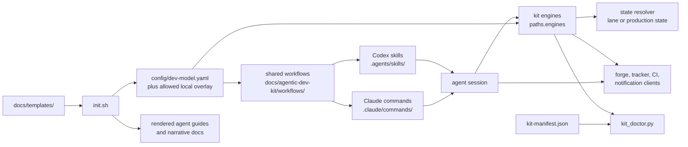
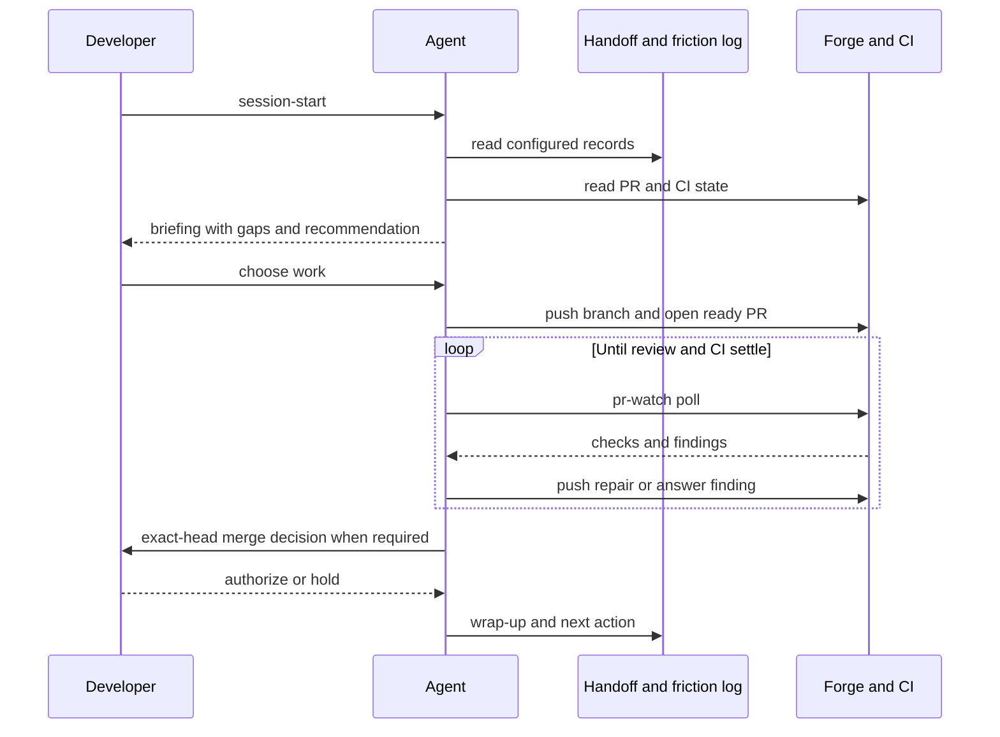
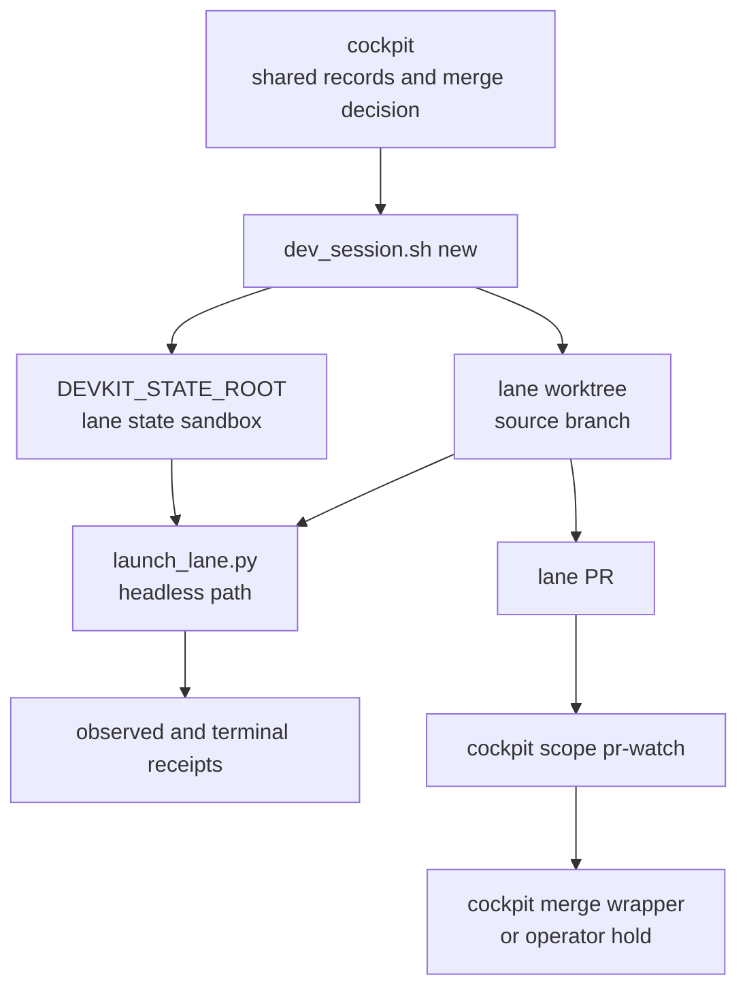
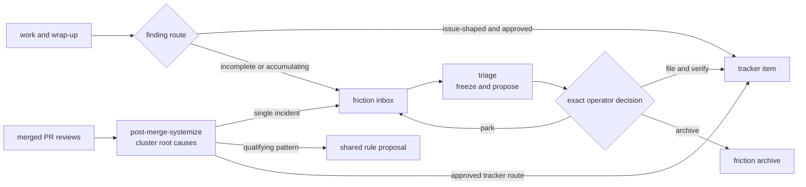

# Architecture

This page explains how the kit's parts fit together. Start with the
[Developer guide](developer-guide.md) for task-oriented instructions. The
[shared workflow definitions](agentic-dev-kit/workflows/) and
[`config/dev-model.yaml`](../config/dev-model.yaml) define behavior; the diagrams
here explain their relationships and do not replace their gates.

## Component map

`config/dev-model.yaml` holds project choices: document paths, runtime launchers,
model mappings, review policy, state patterns, and integration settings. The
gitignored `config/dev-model.local.yaml` can supply the allowed local override;
the merged view is the input to workflows and engines that require it. The
[config reader](../scripts/lib/kitconfig.py) documents the supported syntax and
overlay rules. A value in `models.runtime_mappings` is advisory unless a runtime
control applies it and the result is observed.

The shared workflows own behavior and authority. The Claude command and Codex
skill files are thin entry points that load them; a runtime adapter may translate
invocation and available mechanisms but cannot relax a shared failure or approval
boundary. The [runtime parity contract](agentic-dev-kit/runtime-parity.md) lists
the adapters and documented differences. Keep a workflow change in the shared
definition so Claude and Codex receive it.

The root [AGENTS.md](../AGENTS.md) binds repository-wide instructions for Codex;
[CLAUDE.md](../CLAUDE.md) imports it for Claude Code. Policy that must reach both
clients belongs in that common route or a shared workflow, not solely in
`.claude/rules/`.

`init.sh` migrates supported config and renders unclaimed templates. An adopted
repository owns its rendered narrative docs and root agent guides. The
[upgrade workflow](agentic-dev-kit/workflows/upgrade.md) distinguishes those
adopter-owned files from kit-owned engines and templates; `kit_doctor.py` compares
installed kit-owned files with the manifest and checks installation properties.

### Source map

| Component | Code or contract | Responsibility |
| --- | --- | --- |
| Installer | [`init.sh`](../init.sh), [`docs/templates/`](templates/) | Migrate supported config, seed unclaimed docs and agent guides, install the hook shim. |
| Config reader | [`scripts/lib/kitconfig.py`](../scripts/lib/kitconfig.py) | Read the supported config subset and allowed local overlay. |
| Workflow contracts | [`docs/agentic-dev-kit/workflows/`](agentic-dev-kit/workflows/) | Define preflight, authority, outcomes, and resume behavior. |
| Runtime bindings | [Claude commands](../.claude/commands/), [Codex skills](../.agents/skills/) | Enter the shared workflows from each client. |
| Review and lanes | [`pr_watch.py`](../scripts/pr_watch.py), [`dev_session.sh`](../scripts/dev_session.sh), [`launch_lane.py`](../scripts/launch_lane.py) | Poll and record review state, issue worktrees, and launch bounded headless sessions. |
| State paths | [`scripts/lib/state_paths/`](../scripts/lib/state_paths/) | Resolve workflow artifacts into the declared state root or lane sandbox. |
| Installation inspection | [`kit_doctor.py`](../scripts/kit_doctor.py), [`kit-manifest.json`](../kit-manifest.json) | Report kit-owned drift and installation properties. |

Engines beneath `paths.engines` can be vendored under another directory in an
adopter repository. The links above show this kit repository's default layout.

## Session and pull-request lifecycle

`session-start` is read-only. `pr-watch` checks the exact PR head and review
evidence; opening a PR is not completion. `wrap-up` writes the configured handoff
and routes friction, then follows the repository PR path for changed artifacts.
Merge authority is separate from review readiness. For a non-lane PR without a
project merge policy, the [wrap-up contract](agentic-dev-kit/workflows/wrap-up.md#authority-contract)
holds the merge for an exact operator decision.

## Isolation and state

The worktree separates source edits; `DEVKIT_STATE_ROOT` and the
[state-path resolver](../scripts/lib/state_paths/) separate workflow artifacts.
Neither mechanism removes source-file conflicts between lanes, so the cockpit
plans disjoint footprints. Interactive `new` prepares a worktree and activation
instructions. The headless path adds a one-shot descriptor, child-observed
identity, and terminal receipt through `launch_lane.py`. Review and merge use
the cockpit's scope-aware `dev_session.sh` commands so their evidence stays in
the lane's state sandbox. The [parallel workflow](agentic-dev-kit/workflows/parallel.md)
defines the identity chain and refusal paths.

State reads and writes are workflow-specific. The resolver can select a newer
sandbox or production artifact for a declared cache read; own-session triage
state must instead resolve through its write path so it cannot import another
session's approval evidence. Follow each workflow's path rules before adding an
artifact rather than constructing a `state/` path in a caller.

## Friction flywheel

The routes have different inputs. Triage works from frozen inbox blocks and
requires exact decisions and read-back before it accounts for a tracker write or
sweeps a block. Systemize works from merged PR review evidence and proposes a
shared rule only for a qualifying cross-PR pattern. Its tracker route also needs
payload-specific approval. The [triage](agentic-dev-kit/workflows/triage-friction-log.md)
and [systemize](agentic-dev-kit/workflows/post-merge-systemize.md) contracts own
the details of artifacts, retries, and recovery.

## Where to change behavior

| Change | Owning surface |
| --- | --- |
| Project path, reviewer, model guidance, or integration setting | `config/dev-model.yaml`; migrate a new key through `init.sh` |
| Workflow decision, failure, or approval rule | Shared file under `docs/agentic-dev-kit/workflows/` |
| Runtime invocation or registration | Thin `.claude/commands/` or `.agents/skills/` binding, plus the [parity contract](agentic-dev-kit/runtime-parity.md) |
| Deterministic command or state behavior | Engine under `paths.engines`, with the corresponding behavioral verification |
| Adopter-facing starting content | Template under `docs/templates/`; preserve adopter-owned rendered files |

This source repository keeps its live work in [the kit handoff](kit-handoff.md).
Its dated plans and retained evidence describe the revisions they name; use the
handoff and current contracts when making a new change.

For code changes in this repository, `make test` is the verification entry point.
Changes to gate, launch-authority, or merge-authority behavior in the engines
named by [AGENTS.md](../AGENTS.md) also require the
[safety-critical review doctrine](agentic-dev-kit/safety-critical-changes.md).
