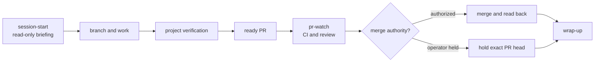

# Developer guide

Use this page when you want to do work with the kit. It gives the short route from a
task to the right command or agent workflow. For the component design and safety
boundaries, see [Architecture](architecture.md). The shared definitions under
[`agentic-dev-kit/workflows/`](agentic-dev-kit/workflows/) are the authority when a
guide and a workflow disagree.

Workflow names below are runtime neutral. In an agent session, invoke a workflow as
`/name` in Claude Code or `$name` in Codex. A workflow invocation is **not** a shell
command. Shell examples assume the kit's default `paths.engines: scripts`; use your
configured `paths.engines` directory in an adopted repository.

## Choose your starting path

| Your situation | Do this | Continue with |
| --- | --- | --- |
| Fresh repository made from the template | Run `./init.sh`, then inspect `config/dev-model.yaml`. | [Getting started](getting-started.md) |
| Existing repository with its own agent rules, config, or CI | Invoke `adopt` and review its selective install plan before it writes. | [Adopt workflow](agentic-dev-kit/workflows/adopt.md) |
| Repository that already has the kit | Invoke `upgrade` to inspect drift, migrate config, and refresh kit-owned files. | [Upgrade workflow](agentic-dev-kit/workflows/upgrade.md) |
| A normal development session | Invoke `session-start`, work on a branch, watch the PR, then invoke `wrap-up`. | [Session loop](#run-a-development-session) |

Do not use `cp -r` on a mature repository: it can overwrite the files whose
ownership `adopt` must inspect. Re-running `init.sh` migrates config and renders
unclaimed templates; it does not replace the drift inspection and file refresh in
`upgrade`.

## Run a development session

1. Invoke `session-start`. It reads the configured handoff and friction log, the
   repository state, and available forge, CI, and tracker sources. An unavailable
   source is reported as a gap. The workflow recommends work but makes no changes.
2. Create a branch from the configured protected branch. In **this kit repository**,
   use `chore/<slug>` or `feat/<slug>` for cockpit work; `dev/` is reserved for
   isolated lanes. For example, after checking that your working tree is ready:

   ```sh
   git fetch origin main
   git switch -c chore/update-guide origin/main
   ```

   Check your project's own branch policy in an adopter repository.
3. Make the change and run the repository's verification command. For this kit,
   run `make test` with a long enough tool timeout to receive the pytest summary.
   Its `check-syntax` target has the limitation recorded in [AGENTS.md](../AGENTS.md);
   inspect changed shell scripts separately until that gap is repaired.
4. Open completed work ready for review. Invoke `pr-watch` for the exact PR, and
   continue through CI and review findings. Ready status starts review; it does
   not grant merge authority. Follow the project's merge policy for the final act.
5. Invoke `wrap-up` after a meaningful session. It records what shipped, routes
   friction, checks document budgets, and leaves the next action in the configured
   handoff. Tracker writes need a decision on their exact payload.



For the full first-session walkthrough, use [Getting started](getting-started.md).
For the review loop and its stop conditions, use the [PR watch workflow](agentic-dev-kit/workflows/pr-watch.md).

## Work in an isolated lane

Use a lane when its source-file footprint is disjoint from other active work. The
cockpit owns the shared handoff, friction log, review coordination, and merge
decision. A lane has a worktree, branch, and separate state sandbox.

From the repository root, substitute your own lowercase scope for `docs-index`:

```sh
scripts/dev_session.sh new docs-index --merge-class operator
scripts/dev_session.sh list
```

`new` prepares the lane. If a launcher is configured, it prints a command to run
in another terminal. If no launcher is configured, it prints a `source .../activate`
command; activate the lane and then start your agent. The command does not move the
current terminal into the worktree. For unattended lanes, use the shared
[parallel workflow](agentic-dev-kit/workflows/parallel.md) and its
[headless companion](agentic-dev-kit/workflows/parallel-headless.md); its launch
descriptor and wrapper carry the required environment and receipt.

`--merge-class operator` keeps the final merge with the operator. A `self` class
still needs project and current-request authority and must merge through the
cockpit's `dev_session.sh merge` wrapper. See the [task recipes](parallel-howto.md)
for watching, reconciling, and removing lanes.

The neutral `cheap`, `default`, and `expensive` tiers help choose compute. A
suggested tier is not proof that a runtime applied a model or effort setting;
follow the [parallel workflow's tier route](agentic-dev-kit/workflows/parallel.md#per-lane-effort-tier-risk--reasoning-effort--model).

## Route friction and recurring findings

Record an incomplete or accumulating finding in the configured friction log. At
`wrap-up`, an issue-shaped finding goes through tracker search and an exact-payload
decision first. Invoke `triage-friction-log` to freeze and review inbox entries;
its approval step decides which entries to file, archive, or park. A budget warning
alone does not authorize a tracker write or archive sweep.

`post-merge-systemize` reads merged PR review findings for recurring root causes.
It proposes a shared-rule change only when the configured pattern threshold is met.
The [triage](agentic-dev-kit/workflows/triage-friction-log.md) and
[systemize](agentic-dev-kit/workflows/post-merge-systemize.md) definitions specify
their preflight, state, approval, and recovery rules.

## Diagnose an installation

Run these from the repository whose installation you are inspecting, with
`scripts` replaced by `paths.engines` when needed:

```sh
uv run scripts/kit_doctor.py
python3 scripts/check_doc_budget.py
```

`kit_doctor` reports kit-owned file drift and installation properties. A `differs`
result requires inspection: a hash mismatch cannot tell an older file from a local
edit. The document-budget command warns by default; its warning is a route to the
configured workflow, not permission to rewrite the narrative documents.

If a workflow stops, keep its exact branch, state, report, and PR identity. Resume
through that workflow's documented entry point after resolving the named cause.
Do not treat an unavailable forge or tracker as an empty result.
