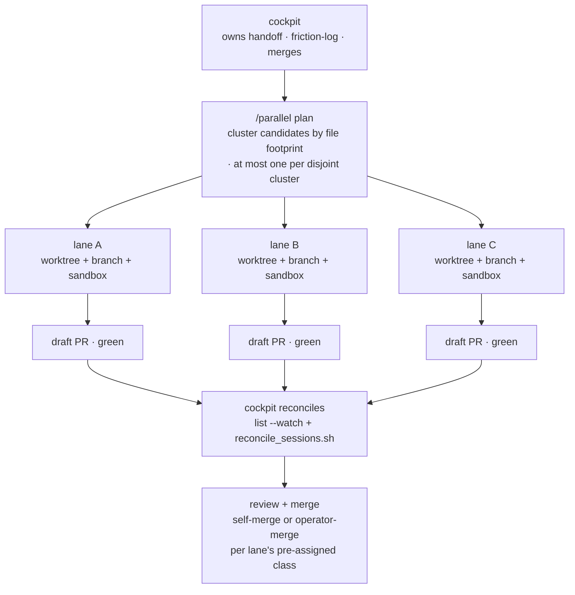

# Parallel dev sessions

Running several AI-agent sessions at once is the fastest way to burn a day of work —
or to corrupt three branches and dilute every review. This kit's answer is
**cockpit + isolated lanes** (Principle #3): one coordinating session owns the shared
narrative and the merges, while each unit of parallel work runs in its own isolated
**lane**. This page explains what a lane is, when parallelism is safe, and the
end-to-end workflow.

Engine: [`scripts/dev_session.sh`](../scripts/dev_session.sh) (launch/list/remove
lanes) and [`scripts/reconcile_sessions.sh`](../scripts/reconcile_sessions.sh)
(drive every lane to a terminal state). The in-session front-end is the
[`/parallel`](../.claude/commands/parallel.md) skill.

## What a lane is

A **lane** is one unit of parallel work, fully isolated:

- **its own git worktree** on a **fresh branch** off `origin/<base>` — so two lanes
  never share a working tree or step on each other's checkout;
- **its own state sandbox** — a `DEVKIT_STATE_ROOT` pointed at a per-lane directory
  (with a `.devkit_state_root` marker file for tool calls that don't inherit the
  shell), so concurrent writes to `state/cache/` and other scratch state can't clobber
  each other. See [`scripts/lib/state_paths/`](../scripts/lib/state_paths/).

The **cockpit** is your main session. It owns the two narrative files
(`docs/handoff.md`, `docs/friction-log.md`), the review pass, and the terminal merge
decision. Lanes never touch the narrative files — they carry their handoff in their
**pull request description**, the one channel that's reviewed and visible across every
lane.

## When parallelism is safe — disjoint file footprints

This is the one rule that matters: **two lanes are safe together only when no source
file is edited by both.**

The state sandbox makes concurrent *scratch-state* writes safe. It does **nothing**
for two branches editing the same source file — that's a merge conflict plus a diluted
review at PR time, and no amount of sandboxing prevents it. So before launching a
batch, **map each candidate's file footprint** and only run truly disjoint work
concurrently. Footprint-mapping is a separate, deliberate step from isolation — the
sandbox prevents *state* collisions, not *source* merge conflicts.

Rule of thumb: parallelize independent features/areas; keep anything that touches a
shared module, schema, or config in the same lane and run it sequentially.

## The workflow



### 1 · Plan the batch — `/parallel plan`

Don't spin up lanes ticket-by-ticket. Compose the batch deliberately:

1. **Orient** — `scripts/dev_session.sh list` + `git worktree list` show the file
   territory already claimed by in-flight lanes; exclude those footprints.
2. **Cluster by footprint** — group candidate tickets by the files each touches (read
   the ticket and grep the code; don't infer from the title). Pick **at most one per
   cluster**; the rest go sequential.
3. **Stale-premise pre-flight** — drop any candidate whose fix may already be shipped
   (a checklist item matching a recently merged PR, a "Done" state that was a bot
   auto-complete). Verify against live code before recommending it.
4. **Scope outward-safe** — a lane that would push to an external system or send a
   notification is scoped to its *in-repo half*; the outward step stays an operator
   action after merge.
5. **Assign an effort tier and a merge class per lane** — decide *up front* how much
   reasoning each lane gets (cheap → top) and whether it may **self-merge** once green
   or must **hand back for operator sign-off**. Deciding the merge boundary at plan
   time stops a batch stalling on ad-hoc "can I merge this?" calls.

### 2 · Launch each lane — `dev_session.sh new`

```bash
scripts/dev_session.sh new <scope> [--base main] [--prefix dev] [--headless]
```

Each `new` creates the worktree + branch + sandbox and prints a copy-paste line that
drops you into the lane. `--headless` instead writes the sticky
`<worktree>/.devkit_state_root` marker so an unattended agent's tool calls resolve the
sandbox from disk (they don't share a shell). Interactive `new` and your CI/cron
runner never set the marker — behavior there is unchanged.

### 3 · Each lane works to a draft-green PR

A lane's job ends at **draft-PR-green**, not at merge. The **lane contract** (injected
into every headless launch; `dev_session.sh print-contract` shows it):

- Open the PR as a **draft** on first push and leave it in draft — the cockpit owns
  ready-for-review, the review pass, and the merge.
- **Actively poll** your own PR's CI to green on a bounded cadence — never idle on a
  "monitor" or someone else's watcher; *you* are the one polling.
- **Never touch** `docs/handoff.md` / `docs/friction-log.md` — carry your handoff in
  the PR description.
- Run `git branch --show-current` before every commit to confirm you're on your lane
  branch, never the protected branch.

### 4 · Watch the board — `list --watch`

```bash
scripts/dev_session.sh list --watch        # re-render every 30s
```

The live board shows every lane's `SCOPE · BRANCH · PR · CI · DIRTY · SANDBOX`, marks
rows that changed since the last frame with a leading `*`, and surfaces a silently-dead
lane that stops moving. Use it as the cockpit's ambient board while a batch runs.

### 5 · Reconcile, then merge — `reconcile_sessions.sh`

Before the cockpit writes anything to the shared handoff, drive **every** launched lane
to a terminal state — **merged**, **parked-with-reason**, or **still-open** — with
`scripts/reconcile_sessions.sh`. An aggregate "everything's done" is *not* evidence a
specific lane actually shipped; reconcile per lane. Then review and merge each per its
pre-assigned merge class, and remove the worktree:

```bash
scripts/dev_session.sh rm <scope>          # tear down the worktree (branch kept if unmerged)
```

## Model / effort tiering per lane

The risk read from planning also sets each lane's reasoning budget (Principle #7): a
mechanical sweep gets a cheap tier; the one lane whose decision is expensive to get
wrong gets the top tier. The tier travels **with the lane** as an explicit field, not
an assumption the lane has to infer — a cheap-tier agent handed a subtle-invariant task
will confidently ship the wrong thing.

## A worked example

You have four open tickets. Planning clusters them by footprint:

| Ticket | Touches | Cluster |
|---|---|---|
| Add rate-limit to the auth endpoint | `auth/` | A |
| Rename the metrics module | `metrics/` (repo-wide import sweep) | B |
| Fix a typo in the CLI help | `cli/help.py` | C |
| Tighten the auth token TTL | `auth/` | A |

Two of them share `auth/` (cluster A) — so you run **one** of them now and defer the
other. You launch three disjoint lanes:

```bash
scripts/dev_session.sh new auth-ratelimit   --headless   # cluster A · top tier · operator-merge
scripts/dev_session.sh new metrics-rename    --headless   # cluster B · cheap tier · self-merge
scripts/dev_session.sh new cli-help-typo     --headless   # cluster C · cheap tier · self-merge
```

Each lane works to a draft-green PR while you watch `list --watch` from the cockpit.
The two cheap self-merge lanes land themselves; the auth rate-limit lane (security-
adjacent) hands back for your review. You reconcile all three, merge, and only then
update `docs/handoff.md` with what shipped — from the cockpit, once.

## See also

- [`parallel-howto.md`](parallel-howto.md) — the task-oriented companion: step-by-step
  recipes per use case, and *what actually happens* when you run each `/parallel` verb.
- [`PRINCIPLES.md`](../PRINCIPLES.md) #3 (cockpit + isolated lanes), #4 (merge classes),
  #7 (effort tiering).
- [`.claude/commands/parallel.md`](../.claude/commands/parallel.md) — the full skill.
- [`docs/getting-started.md`](getting-started.md) — the single-session loop this sits on top of.
