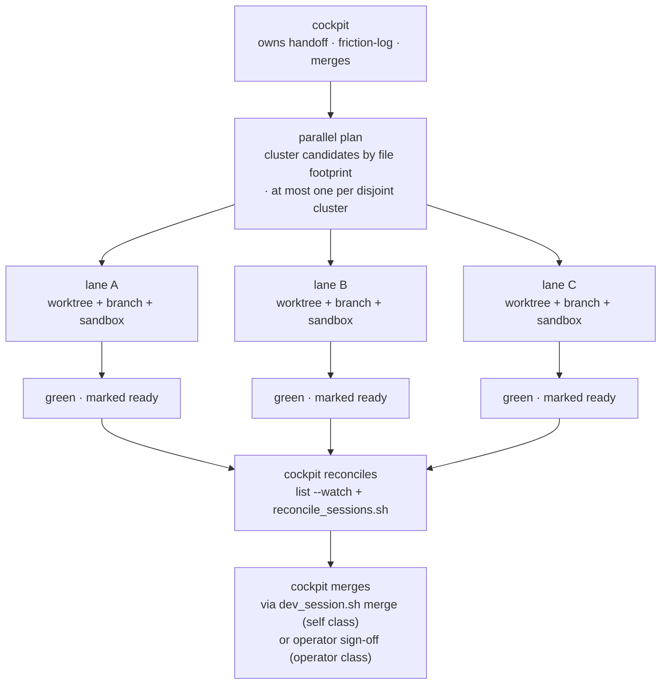

# Parallel dev sessions

Running several AI-agent sessions at once is the fastest way to burn a day of work —
or to corrupt three branches and dilute every review. This kit's answer is
**cockpit + isolated lanes** (Principle #3): one coordinating session owns the shared
narrative and the merges, while each unit of parallel work runs in its own isolated
**lane**. This page explains what a lane is, when parallelism is safe, and the
end-to-end workflow.

Engine: [`scripts/dev_session.sh`](../scripts/dev_session.sh) (launch/list/remove
lanes) and [`scripts/reconcile_sessions.sh`](../scripts/reconcile_sessions.sh)
(drive every lane to a terminal state). The in-session front-end is the
shared [`parallel`](agentic-dev-kit/workflows/parallel.md) workflow. These links use
the template default `paths.engines: scripts`; a namespaced adopter substitutes its
configured directory, such as `scripts/devkit`.

## What a lane is

A **lane** is one unit of parallel work, fully isolated:

- **its own git worktree** on a **fresh branch** off `origin/<base>` — so two lanes
  never share a working tree or step on each other's checkout;
- **its own state sandbox** — a `DEVKIT_STATE_ROOT` pointed at a per-lane directory
  (with a `.devkit_state_root` marker file for tool calls that don't inherit the
  shell), so concurrent writes to `state/cache/` and other scratch state can't clobber
  each other. See [`scripts/lib/state_paths/`](../scripts/lib/state_paths/).

The **cockpit** is your main session. It owns the two narrative files (`paths.handoff`
and `paths.friction_log` in `config/dev-model.yaml` — `docs/handoff.md` and
`docs/friction-log.md` by default), the review pass, and the terminal merge decision.
Lanes never touch the narrative files — they carry their handoff in their
**pull request description**, the one channel that's reviewed and visible across every
lane.

## When parallelism is safe — disjoint file footprints

This is the one rule that matters: **two lanes are safe together only when no source
file is edited by both.**

The state sandbox makes concurrent *scratch-state* writes safe. It does **nothing**
for two branches editing the same source file — that's a merge conflict plus a diluted
review at PR time, and no amount of sandboxing prevents it. So before launching a
batch, **map each candidate's file footprint** and only run truly disjoint work
concurrently. Footprint-mapping is a separate, deliberate step from isolation — the
sandbox prevents *state* collisions, not *source* merge conflicts.

Rule of thumb: parallelize independent features/areas; keep anything that touches a
shared module, schema, or config in the same lane and run it sequentially.

## The workflow


```mermaid
flowchart TD
    CP["cockpit<br/>owns handoff · friction-log · merges"] --> Plan["parallel plan<br/>cluster candidates by file footprint<br/>· at most one per disjoint cluster"]
    Plan --> L1["lane A<br/>worktree + branch + sandbox"]
    Plan --> L2["lane B<br/>worktree + branch + sandbox"]
    Plan --> L3["lane C<br/>worktree + branch + sandbox"]
    L1 --> D1["green · marked ready"]
    L2 --> D2["green · marked ready"]
    L3 --> D3["green · marked ready"]
    D1 --> R["cockpit reconciles<br/>list --watch + reconcile_sessions.sh"]
    D2 --> R
    D3 --> R
    R --> M["cockpit merges<br/>via dev_session.sh merge (self class)<br/>or operator sign-off (operator class)"]
```

### 1 · Plan the batch — `parallel plan`

Don't spin up lanes ticket-by-ticket. Compose the batch deliberately:

1. **Orient** — `scripts/dev_session.sh list` + `git worktree list` show the file
   territory already claimed by in-flight lanes; exclude those footprints.
2. **Cluster by footprint** — group candidate tickets by the files each touches (read
   the ticket and grep the code; don't infer from the title). Pick **at most one per
   cluster**; the rest go sequential.
3. **Stale-premise pre-flight** — drop any candidate whose fix may already be shipped
   (a checklist item matching a recently merged PR, a "Done" state that was a bot
   auto-complete). Verify against live code before recommending it.
4. **Scope outward-safe** — a lane that would push to an external system or send a
   notification is scoped to its *in-repo half*; the outward step stays an operator
   action after merge.
5. **Assign an effort tier and a merge class per lane** — decide *up front* how much
   reasoning each lane gets (cheap → top) and whether it may **self-merge** once green
   or must **hand back for operator sign-off**. Deciding the merge boundary at plan
   time stops a batch stalling on ad-hoc "can I merge this?" calls.

The exact per-step commands, plus the effort-tier and merge-class tables, are in
[`workflows/parallel.md`](agentic-dev-kit/workflows/parallel.md#planning-a-batch--parallel-plan-focus)
— this doc keeps only the reasoning behind each step.

### 2 · Launch each lane — `dev_session.sh new`

Each `new` creates the worktree + branch + sandbox, persists the merge class, and
hands off to the lane: a copy-paste line for an interactive operator, or (`--headless`)
a sticky on-disk marker plus a JSON descriptor for an unattended launcher — the
mechanism a background sub-agent's stateless tool calls need to find their sandbox
without a surviving shell export. Omitting `--merge-class` fails safe to `operator`.
The exact command, every flag, and the headless JSON descriptor are in
[`workflows/parallel.md`](agentic-dev-kit/workflows/parallel.md#starting-a-new-session)
(interactive) and
[`workflows/parallel-headless.md`](agentic-dev-kit/workflows/parallel-headless.md)
(unattended); for task-oriented recipes, see [`parallel-howto.md`](parallel-howto.md).

### 3 · Each lane works to a green, ready-for-review PR

A lane's job ends at **green-and-ready**, not at merge — bound by the same **lane
contract** every launch mechanism injects verbatim into the lane's prompt (mark ready the
moment the branch is complete, active CI polling, never touching the narrative files,
branch hygiene, never merging). Draft is only for the window while commits are still
landing: a finished PR left in draft never triggers the review bots, so it starves itself
of the independent pass the merge gate then demands. **Marking ready is the lane's; landing
it is the cockpit's.** Fetch the contract yourself with `dev_session.sh print-contract`, or
read it in
[`workflows/parallel-headless.md`](agentic-dev-kit/workflows/parallel-headless.md#the-lane-contract-preamble-inject-this-verbatim)
— this doc intentionally doesn't restate it, so the two copies can't drift apart.

### 4 · Watch the board — `list --watch`

```bash
scripts/dev_session.sh list --watch        # re-render every 30s
```

The live board marks every row that changed since the last frame with a leading `*` —
a CI flip, a new commit, the DIRTY count moving, a PR-state change — and surfaces a
silently-dead lane that stops moving. Use it as the cockpit's ambient board while a
batch runs; full behavior (piped output, `--max-iters`, per-call timeouts) is in
[`workflows/parallel.md`](agentic-dev-kit/workflows/parallel.md#live-board--parallel-list---watch-interval).

### 5 · Reconcile, then merge — `reconcile_sessions.sh`

Before the cockpit writes anything to the shared handoff, drive **every** launched lane
to a terminal state — **merged**, **held**, **parked-with-reason**, or **still-open** —
with `scripts/reconcile_sessions.sh`. An aggregate "everything's done" is *not* evidence a
specific lane actually shipped; reconcile per lane. Then review and merge each per its
pre-assigned merge class: a self-merge lane goes through the deterministic wrapper
(re-polls CI/review/merge readiness at act time and refuses missing or operator
metadata); an operator lane is merged only after explicit cockpit sign-off. **held** is
that second kind, seen from the reconciler: an operator lane whose PR is already
merge-ready, so the batch has nothing left to do and the sign-off is the only thing
outstanding. It exits 4 rather than 0 — a held lane has not shipped. The exact
`pr-watch` / `merge` / `rm` command sequence lives in
[`workflows/parallel.md`](agentic-dev-kit/workflows/parallel.md#finishing-a-session)
and [`parallel-howto.md`](parallel-howto.md#use-case-5--wind-a-session-down) — this doc
keeps only the reconcile-before-merge reasoning.

## Model / effort tiering per lane

The risk read from planning also sets each lane's reasoning budget (Principle #7): a
mechanical sweep gets a cheap tier; the one lane whose decision is expensive to get
wrong gets the top tier. The tier travels **with the lane** as an explicit field, not
an assumption the lane has to infer — a cheap-tier agent handed a subtle-invariant task
will confidently ship the wrong thing.

## A worked example

You have four open tickets. Planning clusters them by footprint:

| Ticket | Touches | Cluster |
|---|---|---|
| Add rate-limit to the auth endpoint | `auth/` | A |
| Rename the metrics module | `metrics/` (repo-wide import sweep) | B |
| Fix a typo in the CLI help | `cli/help.py` | C |
| Tighten the auth token TTL | `auth/` | A |

Two of them share `auth/` (cluster A) — so you run **one** of them now and defer the
other. You launch three disjoint lanes:

```bash
scripts/dev_session.sh new auth-ratelimit --headless --merge-class operator  # cluster A · top tier
scripts/dev_session.sh new metrics-rename --headless --merge-class self      # cluster B · cheap tier
scripts/dev_session.sh new cli-help-typo --headless --merge-class self       # cluster C · cheap tier
```

Each lane works to a green, ready-for-review PR while you watch `list --watch` from the
cockpit — each flipping its own PR ready as it finishes, so the review bots pick them up
staggered rather than all at once.
The two cheap self-merge lanes land through `dev_session.sh merge`; the auth rate-limit
lane (security-adjacent) hands back for operator review. You reconcile all three,
merge, and only then update the handoff (`paths.handoff`) with what shipped — from the
cockpit, once.

## See also

- [`parallel-howto.md`](parallel-howto.md) — the task-oriented companion: step-by-step
  recipes per use case, and *what actually happens* when you run each `parallel` verb.
- [`PRINCIPLES.md`](../PRINCIPLES.md) #3 (cockpit + isolated lanes), #4 (merge classes),
  #7 (effort tiering).
- [`agentic-dev-kit/workflows/parallel.md`](agentic-dev-kit/workflows/parallel.md) — the shared workflow, and
  [`agentic-dev-kit/workflows/parallel-headless.md`](agentic-dev-kit/workflows/parallel-headless.md)
  for unattended-lane launch mechanics.
- [`docs/getting-started.md`](getting-started.md) — the single-session loop this sits on top of.
